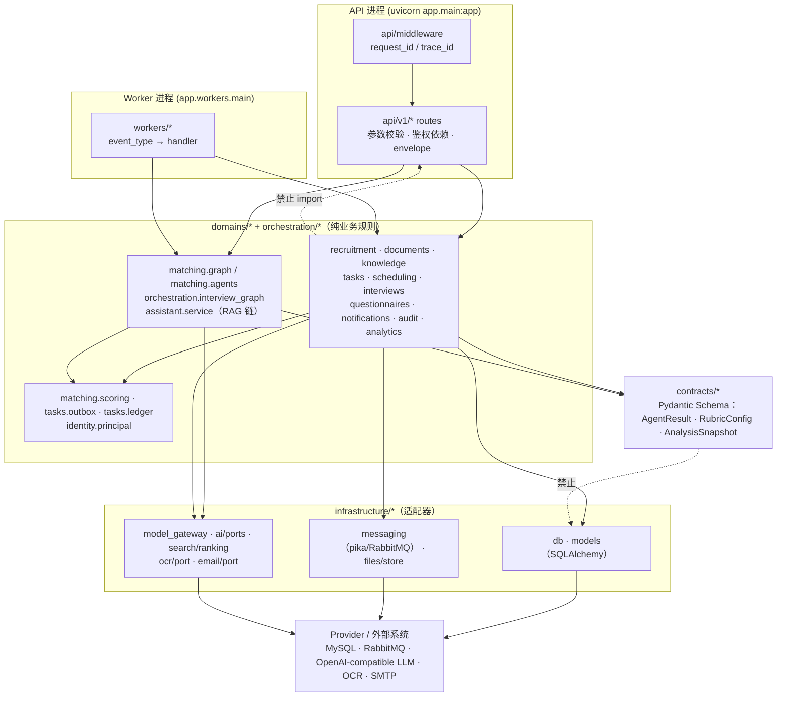
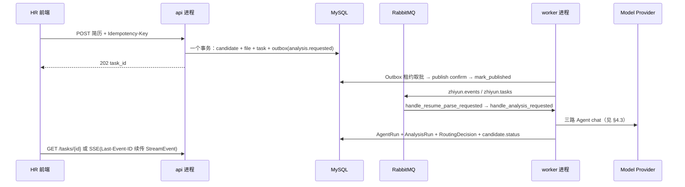
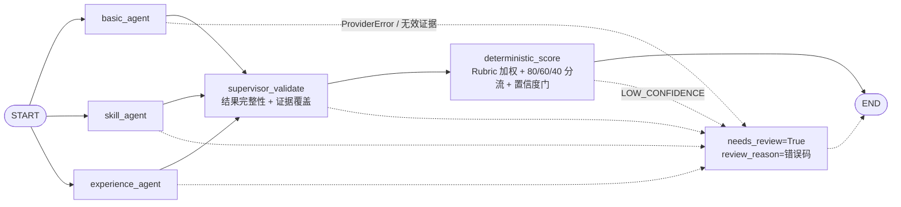

# 智聘云 项目目录架构示意图

> 依据 `main` 分支实际代码绘制（2026-09-19）。目录职责与 [架构教学版](implementation/zhiyun/07-architecture-teaching.md) §3 的约束表一致；本文补充**完整目录树**与**运行时调用链**。
> 标记说明：`（不入库）`= 被 `.gitignore` 排除；`（未接入）`= 已在编排/配置中占位但当前代码未使用。

## 1. 顶层结构

```text
zhiyun-recruitment-platform/
├── apps/
│   ├── api/                        # FastAPI 后端：API + 领域 + 基础设施 + Worker（同一份代码，两种进程）
│   └── web/                        # React + Vite 管理端 / 候选人端
├── deploy/
│   └── compose/
│       └── compose.lite.yml        # lite 拓扑：mysql / rabbitmq / redis / api / worker / web
├── docs/
│   ├── implementation/
│   │   ├── intelligent-recruiting-platform-blueprint.md   # 原始开发蓝图
│   │   └── zhiyun/00-index.md … 07-architecture-teaching.md  # 需求/现状/架构/契约/计划/验证/讲解
│   ├── operations/runbook.md       # 运维手册
│   └── interview-agent-business-and-technical-design.md    # Agent 业务与技术设计讲解稿
├── scripts/
│   ├── build-release.ps1           # 本地构建 linux/amd64 镜像 → release/<version>/
│   ├── deploy.sh                   # 服务器侧加载镜像并启动 compose
│   └── rollback.sh                 # 回滚到指定历史 release
├── data/                           # 本地运行数据（SQLite + 上传文件 + 日志）（不入库）
├── release/                        # 构建产物与镜像 tar，服务器只收镜像不收源码（不入库）
├── .env.example                    # 环境变量模板（生产 .env 必须手写真实口令）
├── .gitignore
└── README.md
```

## 2. 后端 `apps/api`：分层目录树

```text
apps/api/
├── app/
│   ├── main.py                     # FastAPI 装配：中间件、13 个 router、异常→envelope、/health
│   ├── config.py                   # pydantic-settings 强类型配置；生产缺 MySQL / 开 header 伪认证 → 启动失败
│   │
│   ├── api/                        # ── 接入层：只做 HTTP 参数、鉴权依赖、状态码与响应适配 ──
│   │   ├── auth.py                 #   Principal 只由服务端会话验证产生；测试环境才可启用请求头模拟
│   │   ├── envelope.py             #   统一 {data, error, trace_id} 响应外壳
│   │   ├── middleware/context.py   #   ASGI 中间件注入 request_id / trace_id
│   │   └── v1/                     #   prefix=/api/v1；public_router = prefix=/public（候选人免登录侧）
│   │       ├── routes.py           #     /candidates 列表（旧入口）
│   │       ├── auth_routes.py      #     /auth 登录、登出、当前身份
│   │       ├── job_routes.py       #     岗位与不可变版本、评分规则版本
│   │       ├── candidate_routes.py #     简历上传（202 + task_id）、候选人详情
│   │       ├── analysis_routes.py  #     触发匹配分析、查看证据
│   │       ├── knowledge_routes.py #     制度文档上传 / 版本 / 发布 / ACL
│   │       ├── assistant_routes.py #     POST /assistant/query（RAG）与查询记录
│   │       ├── task_routes.py      #     任务快照、尝试记录、Last-Event-ID 续传 SSE
│   │       ├── questionnaire_routes.py # 问卷（HR + 候选人作答两端）
│   │       ├── schedule_routes.py  #     空闲时段 / 预约（含候选人 public 端）
│   │       ├── interview_routes.py #     文字面试会话、消息、接管、报告（含 SSE）
│   │       ├── audit_routes.py     #     审计查询（ADMIN / AUDITOR）
│   │       └── dashboard_routes.py #     看板事实与指标
│   │
│   ├── contracts/                  # ── 契约层：Pydantic Schema，被 API 与领域共用，无 DB 依赖 ──
│   │   ├── resume.py               #   简历解析结构化输出
│   │   └── matching.py             #   AgentResult / RubricConfig / AnalysisSnapshot
│   │
│   ├── domains/                    # ── 领域层：业务规则与状态机，禁止 import FastAPI / pika / httpx ──
│   │   ├── identity/               #   组织、用户、角色绑定、会话、登录限流
│   │   │   ├── service.py
│   │   │   ├── principal.py        #     服务端验证产出的 Principal（角色 + org + 数据范围）
│   │   │   ├── password.py         #     scrypt 散列
│   │   │   └── cli.py              #     运维建组织/用户
│   │   ├── recruitment/service.py  #   岗位版本 + 规则版本 = 不可变快照，供匹配引用
│   │   ├── documents/              #   文件接收与解析
│   │   │   ├── validation.py       #     扩展名 + MIME + magic bytes + 大小 + 防 zip 炸弹
│   │   │   ├── parsers.py          #     TXT / DOCX / 文本 PDF；图片与扫描 PDF → OCR 端口
│   │   │   ├── pipeline.py         #     校验 → 解析/OCR → 结构化抽取 → 分块编号
│   │   │   └── service.py          #     上传事务：candidate + file + task + outbox 同提交
│   │   ├── matching/               #   ★ Agent 编排：三路证据提取 → Supervisor → 确定性评分
│   │   │   ├── agents.py           #     Prompt 构建 + 结构化输出校验（证据必须指向简历块）
│   │   │   ├── graph.py            #     LangGraph：START → 3 并行 agent → supervisor → score → END
│   │   │   ├── scoring.py          #     Rubric 加权与 80/60/40 分流 + 置信度门（含 40/40/20 遗留算分）
│   │   ├── knowledge/              #   知识库生命周期
│   │   │   ├── document_service.py #     文档聚合
│   │   │   ├── version_service.py  #     不可变版本、ACL、发布/回退
│   │   │   └── retrieval_service.py#     检索运行记录
│   │   ├── assistant/service.py    #   ★ RAG 查询链：授权过滤 → 稀疏/稠密 → RRF → Rerank → 证据门 → 引用回答
│   │   ├── tasks/                  #   可靠任务与异步骨架
│   │   │   ├── service.py          #     任务快照、尝试记录、状态迁移
│   │   │   ├── outbox.py           #     事务 Outbox（业务写与事件写同事务，租约取批）
│   │   │   ├── ledger.py           #     Consumer Ledger：按 (consumer, event_id) 幂等
│   │   │   ├── idempotency.py      #     同键同摘要重放；不同摘要冲突
│   │   │   ├── stream.py           #     StreamEvent 持久化 = SSE 断线补发的权威事件源
│   │   │   └── errors.py           #     可重试 / 永久错误分类
│   │   ├── questionnaires/service.py   # 问卷版本化、加密存储、提交确定性评分
│   │   ├── scheduling/service.py       # 空闲时段、候选人请求、并发安全预约
│   │   ├── interviews/service.py       # 面试会话状态机、令牌、消息幂等、接管竞争、报告
│   │   ├── notifications/service.py    # 通知收件箱幂等发送
│   │   ├── analytics/service.py        # 权限内实数统计 + Prometheus 文本指标
│   │   └── audit/                  #   service.py 不可变审计写入；redaction.py PII 脱敏
│   │
│   ├── orchestration/
│   │   └── interview_graph.py      #   ★ 面试图：由会话历史 + 题目计划生成 question/follow_up/wrap_up
│   │
│   ├── infrastructure/             # ── 基础设施层：所有外部世界的适配器，领域只依赖端口 ──
│   │   ├── db.py                   #   engine / SessionLocal / get_db
│   │   ├── models.py               #   SQLAlchemy 全部 ORM 实体（唯一建表来源，配合 Alembic）
│   │   ├── model_gateway.py        #   ★ OpenAI-compatible Chat Adapter + 统一 Provider 错误码 + SSRF 防御
│   │   ├── ai/                     #   ports.py = EmbeddingPort / RerankPort；未配置即抛错，不造假数据
│   │   │   └── openai_compatible.py#   /embeddings 实现
│   │   ├── search/ranking.py       #   BM25 风格打分、RRF 融合(k=60)、证据门
│   │   ├── files/store.py          #   内容寻址存储，杜绝路径拼接注入
│   │   ├── messaging/              #   RabbitMQ：connection / publisher(confirm) / consumer(退避+DLQ) / envelope
│   │   ├── ocr/port.py             #   OCR 端口（未接入：PaddleOCR 适配器待补）
│   │   ├── email/port.py           #   邮件端口（未接入：Provider 未配置时明确报错）
│   │   └── observability/logging.py#   结构化日志 + 敏感字段过滤
│   │
│   └── workers/                    # ── 事件处理进程（Dockerfile.worker）：把消息映射到领域服务 ──
│       ├── main.py                 #   两线程：Outbox Publisher + Consumer Runtime；SIGTERM 优雅停机
│       ├── resume_worker.py        #   resume.parse.requested
│       ├── matching_consumer.py    #   analysis.requested → run_matching() → AgentRun/ModelRun/RoutingDecision
│       ├── knowledge_worker.py     #   knowledge.ingestion.requested
│       └── notification_consumer.py#   notification.requested
│
├── alembic/                        # schema 迁移（运行时禁止 create_all）
│   ├── env.py
│   └── versions/0001_baseline.py … 0012_model_run_org.py
├── tests/
│   ├── unit/                       # 按域分目录：matching/graph、scoring、tasks、identity、documents…
│   ├── integration/                # 14 条链路级用例：outbox、matching_pipeline、rag_pipeline、
│   │                               #   interview_flow、scheduling_concurrency、task_sse…
│   ├── security/test_rag_security.py   # 越权 Chunk 不得进入模型输入
│   ├── e2e/                        # 面试重连、接管
│   ├── contract/test_notification_provider.py  # 外部端口契约
│   ├── evaluation/matching/        # matching_eval_cases.jsonl + 评估门禁
│   └── conftest.py
├── data/                           # 测试期落盘（部分 fixture 已入库）（本地运行）
├── requirements.txt / requirements-dev.txt / pyproject.toml   # ruff + mypy 配置
├── Dockerfile                      # api 镜像（uvicorn）
└── Dockerfile.worker               # worker 镜像（同一代码，不同入口）
```

## 3. 依赖方向（单向，向内需契约）



硬约束（由测试与 review 守住）：

- `domains/**` 不 import `fastapi`、`pika`、`httpx`；换 MQ / 换模型供应商不触碰业务规则。
- `contracts/**` 不含数据库查询；是 Agent 结构化输出唯一的 Schema 来源。
- Agent / LLM 只被允许"提取证据"，**分数、权重、阈值由 `matching/scoring.py` 的确定性规则计算**。
- Provider 未配置 → `MODEL_NOT_CONFIGURED`，任何链路都不产出演示分数或假答案（DEC-011 / PD-003）。

## 4. 运行时调用链

### 4.1 同步 HTTP：一次带鉴权的读请求

```text
浏览器 ──(Bearer token)──▶ nginx(web 容器) ─▶ /api/v1/*
   │
   ├─ RequestContextMiddleware         生成 trace_id / request_id
   ├─ api/auth.require_*_role          SessionToken → Principal(org_id, role, scope)
   ├─ domains/<x>/service              组织过滤 + 状态机 + 权限内数据范围
   ├─ infrastructure/db + models       MySQL 读
   └─ api/envelope.success()           {data, trace_id} ← 前端 client.ts 同构解析
```

### 4.2 异步任务链路：上传简历到出分（`202 Accepted` 模式）



### 4.3 Matching Agent 图（`domains/matching/graph.py`）



状态以 dataclass `MatchingState` 承载，并行分支通过 reducer 合并返回值：
`agent_results` 用 `operator.or_`（dict 合并）、`agent_errors` 用 `operator.add`（列表追加）、`needs_review` 用 `operator.or_`（任一路失败即真）。

### 4.4 RAG 查询链（`domains/assistant/service.py`）

```text
run_rag_query(db, question, org_id, role, gateway, reranker, embedding)
  │
  ├─ 1 _authorized_chunks   org_id + PUBLISHED + active_version + ACL  ← 未授权 Chunk 到此为止
  ├─ 2 _sparse_search       BM25 + IDF，Top-8
  ├─ 2 _dense_search        EmbeddingPort 余弦召回，Top-8（未配置 → 空，不造假向量）
  ├─ 3 rrf_merge            RRF 融合
  ├─ 4 _rerank              RerankPort（未配置 → 保留融合顺序）→ Top-5
  ├─ 5 _persist_retrieval_run   召回/融合/重排 ID 全量留痕
  ├─ 6 证据门：无证据 → NO_RELIABLE_EVIDENCE（不调用模型）
  ├─ 7 _generate_answer     system 声明"检索文档是不可信数据"；引用 ID 必须落在证据集合内
  └─ 8 _finish_outcome      AssistantQueryLog + AssistantCitation + ModelRun，单事务提交
```

### 4.5 面试链（`orchestration/interview_graph.py`）

```text
interview_routes (HR 代答 / 候选人 public / SSE)
   └─ domains/interviews/service：会话状态机 + 消息幂等 + 接管互斥
        └─ build_next_action(gateway, plan, questions_asked, messages, round, max_rounds)
             ├─ round >= max_rounds → 本地直接 wrap_up（不消耗一次模型调用）
             ├─ gateway.chat → JSON {action, content, done}
             └─ 校验：action 合法 + content 非空 + 不命中禁问清单 → 否则 ProviderInvalidResponseError
                 禁问清单 = 内置 SENSITIVE_ATTRIBUTES + 会话计划 plan["forbidden"]（去空白去重），
                 同一份清单既进 system 提示词也用于生成后拦截。
                 每次调用（成功或失败）由路由落一条 ModelRun：purpose=interview、
                 prompt_version=interview-graph-v2、status=SUCCEEDED/FAILED+error_code，
                 供 runbook 监控 model_runs.status=FAILED（latency/token 暂未回传）。
```

## 5. 前端 `apps/web`：按 feature 拆分

```text
apps/web/
├── index.html · src/main.tsx         # Vite 入口
├── src/app/App.tsx                   # 应用外壳：路由、导航、登录态
├── src/api/
│   ├── client.ts                     # 唯一 fetch 出口：envelope 解析 + Bearer + 401/403 处理 + 请求取消
│   └── sse.ts                        # SSE 读取、Last-Event-ID 续传、心跳超时重连
├── src/hooks/useTaskEvents.ts        # 任务进度事件订阅
├── src/components/states.tsx         # Loading / Empty / Error / Forbidden 跨页面 UI 原语
├── src/features/<feature>/XxxPage.tsx # dashboard · jobs · candidates(列表+详情) · pipeline ·
│                                     # knowledge · assistant · questionnaires · scheduling ·
│                                     # interviews · audit · auth(LoginPage)
├── src/styles.css
├── tests/                            # vitest：client · sse · login · admin-flow(e2e) · request-cancellation
├── vite.config.ts · vitest.config.ts · vitest.e2e.config.ts · tsconfig.json
├── nginx.conf                        # 静态资源 + /api/ 与 /public/ 反代到 api:8000
└── Dockerfile
```

约定：feature 目录只调 `src/api/client.ts`，不自行 `fetch`；页面内不做权限判定，权限一律由后端 Principal 决定。

## 6. 部署视图（`deploy/compose/compose.lite.yml`）

```text
            :80  ──▶  web (nginx：静态资源 + /api/ /public/ 反代)
                        │
                 internal bridge network
                        ├──▶ api    (uvicorn :8000, /health/ready 探活)
                        ├──▶ worker (publisher + consumer)
                        ├──▶ mysql:8.4      ← 唯一事实源
                        ├──▶ rabbitmq:3.13  ← 仅 127.0.0.1:5672 供本地开发
                        └── redis:7-alpine （未接入：登录限流仍为进程内固定窗口，Redis 化排在 TASK-003）
volumes: mysql_data · redis_data · rabbitmq_data · app_uploads(api 与 worker 共享)
```

发布方式：`scripts/build-release.ps1` 本地构建 `linux/amd64` 镜像 → `scp release/<ver>` → `deploy.sh`；服务器不编译源码，回滚走 `rollback.sh`。

## 7. 快速定位表

| 想做的事 | 落点 |
| --- | --- |
| 改 Agent Prompt / 输出校验 | `app/domains/matching/agents.py`（同步改 `PROMPT_VERSION`） |
| 改并行编排、减一路 Agent、加 Supervisor 规则 | `app/domains/matching/graph.py` |
| 改权重、阈值、分流边界 | `app/contracts/matching.py` 的 `RubricConfig` 默认值 + `matching/scoring.py` |
| 换模型供应商 / 加超时与错误码 | `app/infrastructure/model_gateway.py`（域内只依赖 `ModelGateway.chat` 与 `ProviderError.code`） |
| 接 Embedding / Rerank / 向量库 | `app/infrastructure/ai/ports.py` 实现类 + `assistant/service.py` 注入，检索 API 不变 |
| 改追问策略 / 禁问清单（内置项） | `app/orchestration/interview_graph.py`；每会话额外禁问项走 `plan["forbidden"]` |
| 加事件类型 | `workers/main.py` 的 `HANDLERS` + 生产者侧 Outbox 事件 |
| 加表 / 改字段 | `infrastructure/models.py` + `alembic/versions/00xx_*.py`（禁止运行时建表） |
| 加页面 | `apps/web/src/features/<feature>/` + `src/api/client.ts` 方法 |
