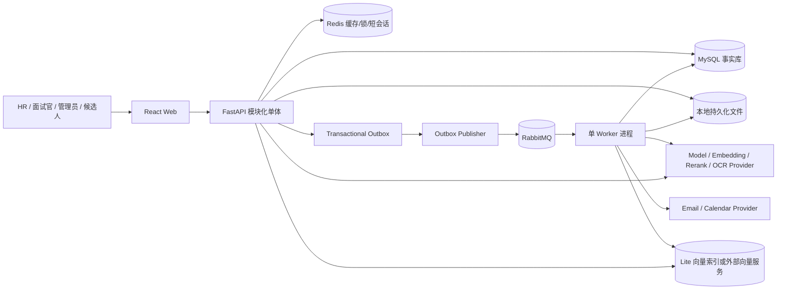
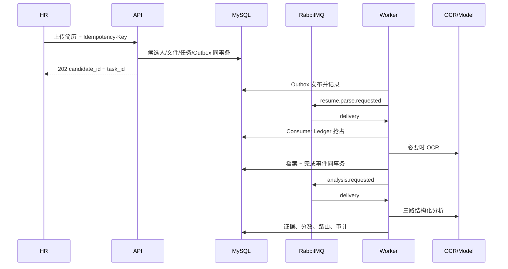

# 智聘云开发蓝图：目标架构与模块边界

## 1. 架构选择

`DECIDED` 使用模块化单体，而不是第一阶段微服务：

- 目标服务器只有 2 vCPU/2 GiB，部署和观测多个服务得不偿失；
- 业务事务主要围绕同一个招聘事实库，模块化单体更容易保证一致性；
- API、Worker 镜像可共享领域代码，但以不同进程运行；
- RabbitMQ 只用于已确认的长耗时、可重试任务，不把所有模块通信都事件化。

以下复杂度被明确拒绝：Kubernetes、事件溯源、通用 BPM 引擎、独立 API Gateway、多数据库分片和无消费者的插件系统。出现持续容量瓶颈、独立团队所有权或不同合规边界后再评估拆分。

## 2. 总体结构



`lite` 中 Outbox Publisher、Document、Matching、Notification、RAG Consumer 运行在一个 Worker 进程内，但保持独立 handler 和队列/路由键。未来增加 Worker 只改变部署拓扑，不改变事件或领域契约。

## 3. 依赖方向

```text
api/routes -> application/use_cases -> domains -> contracts
workers/consumers -> application/use_cases -> domains -> contracts
infrastructure/adapters implements domains/contracts ports
domains never import FastAPI, SQLAlchemy Session, RabbitMQ client or provider SDK
```

允许同进程查询其他模块的公开 Query Service；禁止跨模块直接更新表。跨模块产生异步副作用时，由所有者在事务中写 Outbox。

## 4. 模块合同

| 模块 | 责任 / 非责任 | 公共输入输出 | 依赖与测试重点 |
| --- | --- | --- | --- |
| Identity & Access | 用户、会话、角色、资源授权；不决定招聘结果 | 登录/登出、`Principal`、授权策略 | MySQL、密码/SSO Adapter；权限负向测试 |
| Audit | 不可变审计、PII 脱敏；不保存完整业务副本 | `AuditRecord` 写入、授权查询 | Identity、MySQL；覆盖率和篡改测试 |
| Recruitment | 岗位、版本、候选人、状态和人工决定；不解析文件 | REST、Query Service、领域事件 | Identity、Tasks；状态机和组织隔离 |
| Document Intelligence | 文件校验、解析、OCR、结构化档案；不评分 | `resume.parse.requested/completed` | FileStore、OCR；恶意文件和质量门 |
| Matching | Agent 证据、Supervisor、确定性评分和路由；不自动录用/拒绝 | `analysis.requested/completed`、分析查询 | Model Gateway、Recruitment Query；评估集 |
| Tasks & Messaging | 任务、尝试、Outbox、Publisher、Consumer Ledger、DLQ | 任务 API、事件 envelope | MySQL、RabbitMQ；崩溃恢复和幂等 |
| Questionnaire | 模板/版本、邀请、提交和评分；不发邮件 | REST、`questionnaire.invitation.requested` | Recruitment、Notification；令牌与重复提交 |
| Scheduling | 可用时段、预约、冲突；不拥有日历供应商 | REST、`reservation.created/cancelled` | MySQL、Redis 可选；并发约束 |
| Notification | 模板、发送账本、邮件/日历 Adapter；不决定何时招聘 | `notification.requested`、发送状态 | Provider、Tasks；副作用幂等 |
| Interview | 会话、消息、LangGraph 状态、人工接管、报告 | REST/SSE、`interview.completed` | Model Gateway、Recruitment Query；恢复与接管 |
| Knowledge | 文档、版本、ACL、摄取和发布；不生成回答 | REST、`knowledge.ingestion.requested` | FileStore、RAG Index；版本原子切换 |
| Assistant/RAG | 授权检索、融合、重排、上下文和引用回答；不改知识或调用写工具 | 查询 API/SSE、引用结果 | Knowledge Query、Model Gateway、Vector/Search |
| Analytics | 从事实表形成授权统计；不成为业务事实源 | 仪表盘查询 | 各模块只读 Query；数值一致性 |
| Provider Gateway | Chat/Embedding/Rerank/OCR/Email/Calendar 适配和错误归一化；不含业务规则 | 稳定 Port、Provider 元数据 | 外部 API；超时、限流、Schema |

隐藏实现包括具体 SDK 响应、RabbitMQ routing 配置、SQLAlchemy 对象、Prompt 原文和 Provider 密钥；它们不得泄露到公共 API。

## 5. 主业务链路

### 5.1 简历导入、解析与匹配



解析质量门：

- 文件验证失败直接拒绝，不创建可处理任务；
- OCR 失败或低于 Provider/业务配置阈值进入 `NEEDS_REVIEW`；
- 关键字段缺失不自动补造；
- 只有 `PARSED` 且质量合格的简历可进入自动匹配。

### 5.2 Matching LangGraph

```text
load_snapshot
  -> fan_out:
       basic_agent
       skill_agent
       experience_agent
  -> supervisor_validate
  -> evidence_consistency_check
  -> deterministic_score(rubric_version)
  -> confidence_gate
  -> route_or_human_review
  -> persist
```

Agent 输入是不可变 `job_version`、`rubric_version`、`resume_version` 和最小必要结构化文本。每个 Agent 输出：

```json
{
  "dimension": "skills",
  "raw_score": 0,
  "confidence": 0.0,
  "evidence_refs": ["resume_block_id"],
  "missing_fields": [],
  "reason_codes": []
}
```

Supervisor 只验证冲突、缺失和证据覆盖，不自行修改权重。确定性评分器应用版本化规则。任何 Agent 超时、结构错误、证据引用不存在或总体置信度不足，结果为 `NEEDS_REVIEW`，不生成普通自动分流。

### 5.3 RAG 摄取全链路

```text
upload
 -> file_validation
 -> create immutable version
 -> parse_or_ocr
 -> quality_check
 -> normalize sections/pages
 -> parent_child_chunk
 -> content_hash/deduplicate
 -> embedding batch
 -> dense index upsert
 -> sparse/BM25 index build
 -> index manifest commit
 -> INDEXED
 -> explicit publish
 -> PUBLISHED
```

设计约束：

- Parent 负责完整上下文，Child 负责召回；实际 token 参数通过评估冻结，不把现有字符数当成最终参数。
- Chunk 关联 `org_id`、文档、版本、页码/段落、ACL、解析器版本、Embedding 模型版本。
- 向量写入成功不等于可发布；只有 Index Manifest 记录 Dense/Sparse 数量一致后进入 `INDEXED`。
- 发布在 MySQL 中原子切换活动版本；检索通过活动版本过滤，向量库短暂残留旧向量也不会被使用。
- 重建生成新索引版本，不原地破坏当前生产索引。

### 5.4 RAG 查询全链路

```text
authenticate
 -> normalize query
 -> derive org/role/resource filters
 -> dense retrieve(topN)
 -> BM25 retrieve(topN)
 -> ACL/version filter before content leaves retrieval
 -> RRF merge
 -> deduplicate/diversify
 -> rerank
 -> evidence threshold/conflict check
 -> context assembly
 -> answer prompt
 -> structured answer parse
 -> citation validation
 -> persist query/model metadata
 -> response
```

关键安全边界：

- Filter 来自服务端 Principal，客户端不能提交更高权限角色。
- 未授权 Chunk 不进入 Rerank 和生成模型输入。
- Prompt 分为系统政策、任务模板和不可信文档区；文档指令永远按数据处理。
- 模型输出中的 citation ID 必须属于本次允许证据集合，否则解析失败。
- 无证据、证据冲突、Rerank/模型不可用时显式拒答或返回检索证据，不得生成制度结论。

### 5.5 AI 文字面试

```text
DRAFT -> INVITED -> IN_PROGRESS -> PAUSED -> IN_PROGRESS
                              \-> TAKEN_OVER -> COMPLETED
                    IN_PROGRESS -> COMPLETED -> REVIEWED
```

处理顺序：

1. 验证候选人短期令牌和会话状态；
2. 使用客户端消息 ID 幂等保存候选人消息；
3. 锁定会话版本，加载岗位/档案/问题计划；
4. Interview Graph 生成结构化下一动作；
5. 再次检查会话未被接管；
6. 保存 AI 消息与 SSE 事件后发送；
7. 达到结束条件时生成报告草稿，等待面试官审核。

人工接管与 AI 回复竞争时，数据库状态版本决定胜者；接管提交后任何未提交 AI 回复作废。

## 6. 可靠任务与失败边界

### 6.1 事务 Outbox

API 或 Worker 在同一 MySQL 事务中写业务状态和 `outbox_events`。Publisher 使用租约批量读取，发布到持久化 Exchange，收到 Broker Confirm 后标记 `PUBLISHED`。发布确认前崩溃可能导致重复消息，由消费者幂等处理。

### 6.2 Consumer Ledger

消费者以 `(consumer_name, event_id)` 唯一约束抢占。处理结果与业务写入同事务：

- 已 `SUCCEEDED`：确认消息，不重复副作用；
- `PROCESSING` 且租约有效：稍后重试；
- 租约过期：允许新尝试接管；
- 可重试错误：记录 `next_retry_at` 并投递延迟/重试队列；
- 永久错误或超过上限：进入 DLQ 并将任务标记为需要人工处理。

### 6.3 Provider 失败

统一错误：`NOT_CONFIGURED`、`TIMEOUT`、`RATE_LIMITED`、`AUTH_FAILED`、`INVALID_RESPONSE`、`UNAVAILABLE`。只有超时、限流和暂时不可用可按策略重试；认证、配置和 Schema 错误直接阻断并告警。业务层只看归一化错误，不依赖供应商字段。

## 7. Lite 与未来 Full

### `lite` 当前目标

- Web、API、单 Worker、MySQL、Redis、RabbitMQ；
- 本地持久化上传目录；
- 外部 Chat/Embedding/Rerank/OCR/Email/Calendar；
- 低并发、受限批次、Docker 日志轮转；
- 不运行完整 Milvus；向量能力选择外部服务或经容量验证的轻量适配器。

### `full` 触发条件

只有 `PD-008` 的容量证据显示单 Worker或外部索引不能满足需求，且服务器资源升级后，才增加独立 Worker、MinIO、完整 Milvus 和观测组件。领域 API、事件 envelope、Index Port 和 Provider Port 保持不变。

## 8. Consumer Ledger

| 增加项 | 生命周期所有者 | 已确认消费者 | 消费改变的行为 | 缺失测试 |
| --- | --- | --- | --- | --- |
| `job_versions` | Recruitment | Matching、Interview | 分析与面试使用稳定 JD | 修改岗位后旧分析结果漂移 |
| `rubric_versions` | Recruitment | Matching | 决定分数和分流 | 无法解释边界结果 |
| `resume_versions/blocks` | Document | Matching、UI | 提供可定位证据 | 评分无来源 |
| `outbox_events` | Tasks | Publisher | 提交后可靠触发异步工作 | API 成功但任务不启动 |
| `consumer_deliveries` | Tasks | 所有 Consumer | 消息幂等和恢复 | 重复处理产生副作用 |
| `task_attempts` | Tasks | 运维、重试器 | 决定退避/DLQ | 失败无法诊断或重放 |
| `audit_logs` | Audit | 审计人员、安全排查 | 追踪敏感操作 | 无法证明谁做了改判/下载 |
| `model_runs` | Provider Gateway | 质量评估、审计 | 关联模型/Prompt/成本 | AI 结果不可复现 |
| `notification_deliveries` | Notification | Provider Worker、HR | 保证外部发送幂等 | 重试重复发信 |
| `schedule_reservations` | Scheduling | Interview、通知 | 锁定唯一时段 | 双重预约 |
| `interview_events` | Interview | SSE、恢复逻辑 | 补发断线事件 | 重连丢消息 |
| `knowledge_index_manifests` | Knowledge | 发布、Retriever | 决定版本是否可发布 | 部分索引被当成完整 |
| `knowledge_acl` | Knowledge | Retriever | 检索前授权 | 未授权文本进入模型 |
| `retrieval_runs` | Assistant | RAG 评估、审计 | 解释召回/融合/重排 | 无法定位错误阶段 |
| `assistant_citations` | Assistant | UI、审计 | 用户核验回答 | 回答不可追溯 |

表和组件只有在对应任务实现其生产到消费路径时才能加入生产 schema。

## 9. 未来变更影响

| 可能变化 | 会改变 | 不应改变 |
| --- | --- | --- |
| 更换模型/Embedding/Rerank | Provider 配置、Adapter、评估基线 | Recruitment、Knowledge 生命周期、公共 API |
| 增加 PDF 版面解析器 | Document Parser Adapter、解析器版本 | Matching 契约和评分规则 |
| 增加语音面试 | 新媒体存储/转写模块、Interview 输入事件 | 人工接管、报告审核、招聘决定边界 |
| 增加完整 Milvus | Vector Index Adapter、Compose full | Chunk/ACL/Index Manifest 和查询 API |
| 多组织 SaaS | Identity、组织配置、计费及隔离运维 | 现有 `org_id` 过滤原则 |
| 拆分 Worker | Compose 和队列消费者部署 | 事件 envelope、Consumer Ledger、领域处理器 |

这些变化均不得提前引入无消费者的基础设施。
