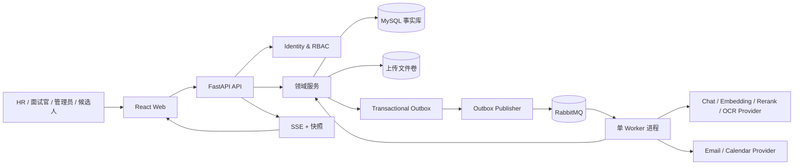
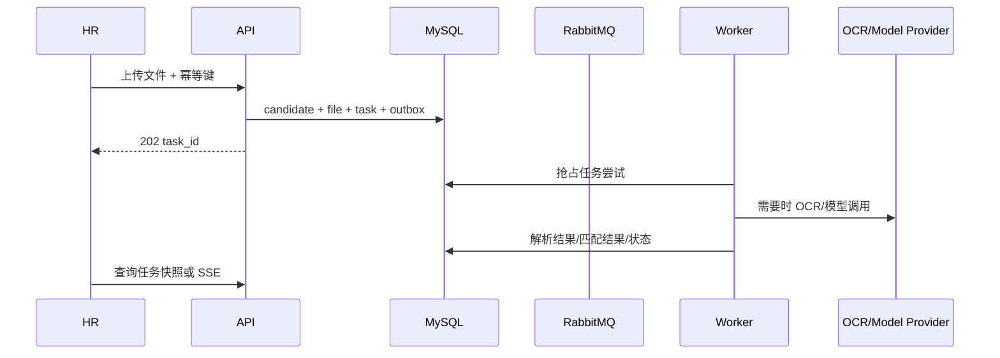

# 智聘云架构教学版：从业务流程到代码实现

> 文档目的：帮助新加入项目的开发者建立“为什么这样设计”的完整心智模型，而不是只记目录。
>
> 生成日期：2026-09-15  
> 分析模式：`Existing-project + teaching mode`  
> 仓库状态：当前目录不是 Git 仓库，无法提供提交历史或 commit 级别的变更证据。

## 0. 先记住一句话

智聘云是一个“React 管理台 + FastAPI 模块化单体 + Python 异步 Worker”的企业招聘平台：

```text
用户操作
  -> HTTP API 做认证、校验和事实写入
  -> MySQL 保存可追溯业务状态
  -> Outbox 可靠地产生异步事件
  -> RabbitMQ 投递给 Worker
  -> Worker 执行解析、匹配、知识摄取、通知等长任务
  -> SSE/快照把进度交还给 Web
```

这个项目的核心不是“把 AI 接上去”，而是让 AI 成为一个可审计、可失败、可人工复核的流程组件。岗位版本、简历版本、知识版本、规则版本和模型运行记录共同保证结果可解释、可重放、可回滚。

文档中的证据标签含义：

- `VERIFIED`：在当前代码、配置或测试中可以直接看到并验证。
- `INFERENCE`：根据代码结构和现有蓝图推断出的设计意图，可能需要进一步评审。
- `UNKNOWN`：仓库没有足够证据，不能替业务方做决定。

## 1. 从业务目标开始，而不是从框架开始

### 1.1 业务分解

`VERIFIED/DECIDED` 平台服务四类内部角色和候选人：管理员管理组织、账号、知识发布和审计；HR 管理岗位与候选人并做人工决定；面试官只处理分配给自己的候选人和面试；候选人通过短期链接参与问卷、预约或文字面试。

招聘主流程是：

```text
岗位/JD 版本
  -> 简历导入
  -> 解析与质量门
  -> 匹配证据与确定性评分
  -> 面试 / 问卷 / 人才池 / 人工复核
  -> 排期、通知、AI 文字面试
  -> 人工审核后的招聘决定
```

知识助手是另一条闭环：

```text
上传制度
  -> 解析/分块/索引
  -> 管理员显式发布
  -> 按组织和角色检索
  -> 生成带引用的回答，或明确拒答
```

### 1.2 为什么不把所有东西写进一个大路由

**设计决策**：路由只负责 HTTP 适配，领域服务负责业务规则，基础设施负责数据库、消息队列、文件和 Provider。

**为什么这样设计**：招聘结果、权限、重试和外部通知的失败方式不同。把它们混在路由里会让“请求返回成功”误等于“后台业务完成”，也会让测试必须启动完整外部环境。

**代码位置**：

- HTTP 入口：`apps/api/app/api/v1/*.py`
- 领域规则：`apps/api/app/domains/*/`
- 数据库模型与会话：`apps/api/app/infrastructure/models.py`、`apps/api/app/infrastructure/db.py`
- 外部适配器：`apps/api/app/infrastructure/ai/`、`email/`、`files/`、`messaging/`

**验证方式**：领域单元测试不应需要 FastAPI `Request`、RabbitMQ 连接或真实模型；集成测试再验证这些边界。当前后端全量测试命令为：

```powershell
$env:PYTHONPATH = "apps/api"
python -m pytest apps/api/tests -q
```

## 2. 总体架构：模块化单体，而不是微服务集群

### 2.1 结构图



### 2.2 为什么是模块化单体

**业务分解**：当前部署目标是单台约 2 vCPU、2 GiB RAM 的 Linux 主机，业务事实主要围绕同一个数据库，团队也需要先快速建立可靠边界。

**设计决策**：API 和 Worker 可以是不同进程/镜像，但领域代码按模块组织；第一阶段不拆成多个微服务。

**为什么这样设计**：

1. 共享 MySQL 事务可以直接保证岗位、候选人、任务和 Outbox 一致提交。
2. 单 Worker 更适合受限机器，运维成本低于多个独立服务。
3. 未来如果容量或团队边界真的出现，只需要把消费者拆到不同部署，事件 envelope 和领域契约仍可复用。

被明确排除的复杂度：Kubernetes、事件溯源、通用工作流引擎、无消费者的插件系统、多数据库分片。它们只有在容量、合规边界或团队所有权提供证据后才值得引入。

**代码位置**：`apps/api/app/workers/main.py` 同时启动 Outbox Publisher 和 RabbitMQ Consumer；`deploy/compose/compose.lite.yml` 定义 `web`、`api`、`worker`、`mysql`、`redis`、`rabbitmq` 六个容器。

**验证方式**：

```powershell
docker compose -f deploy/compose/compose.lite.yml config
```

配置可以解析不等于生产就绪；还需要目标 Linux 上的资源、备份、健康门和回滚演练。

## 3. 目录地图：每一层解决什么问题

| 目录                            | `VERIFIED` 当前责任                       | 不应放进去的东西                          |
| ----------------------------- | ------------------------------------- | --------------------------------- |
| `apps/web/src/app`            | 应用外壳、路由、错误边界、主导航                      | 具体业务 API 细节                       |
| `apps/web/src/features`       | 按业务能力组织的页面：岗位、候选人、知识、助手、面试等           | 全局认证或底层 fetch 逻辑                  |
| `apps/web/src/api`            | 统一 envelope 解析、Bearer Token、SSE 解析与重连 | 业务决策和 Prompt                      |
| `apps/web/src/components`     | 加载、空、错误、无权限等跨页面 UI 原语                 | 直接读数据库或调用 Provider                |
| `apps/api/app/api/v1`         | HTTP 参数、依赖注入、状态码和响应适配                 | 长耗时任务实现、模型 Prompt                 |
| `apps/api/app/domains`        | 身份、招聘、文档、匹配、知识、任务、排期、通知、面试等业务规则       | FastAPI、RabbitMQ SDK、Provider SDK |
| `apps/api/app/contracts`      | Pydantic 输入/输出和 AI 结构化 Schema         | 具体数据库查询                           |
| `apps/api/app/infrastructure` | SQLAlchemy、文件、消息、模型、OCR、邮件和日志适配器      | 组织权限或评分业务规则                       |
| `apps/api/app/workers`        | 事件处理器，将消息映射到领域服务                      | HTTP 响应格式                         |
| `apps/api/alembic`            | 版本化 schema 迁移                         | 运行时 `create_all`                  |
| `apps/api/tests`              | 单元、集成、安全、评估和 E2E 证据                   | 真实生产数据                            |
|                               |                                       |                                   |

**依赖方向**：

```text
routes -> domain/application -> contracts
workers -> domain/application -> contracts
infrastructure adapters -> ports/contracts
```

这是“低耦合”的具体含义：替换 RabbitMQ、模型供应商或检索实现，不应该迫使岗位领域重新编写。

## 4. 最重要的三条业务链路

### 4.1 简历：为什么上传接口返回 202

**业务分解**：文件上传、解析/OCR、质量判断和匹配都可能耗时或失败；用户需要先得到任务编号，而不是一直占住 HTTP 请求。

**设计决策**：API 在一个数据库事务里创建候选人、文件、任务和 Outbox 事件，然后返回 `202 Accepted`；Worker 负责后续处理。



**为什么这样设计**：

- 事务保证“接口说已接受”时任务确实有可恢复记录。
- `TaskAttempt`、租约和重试让进程崩溃后可以接管，而不是丢在内存里。
- 解析质量不足、OCR 未配置或模型失败进入 `NEEDS_REVIEW`/失败状态，不用假数据掩盖问题。

**代码位置**：

- 上传入口：`apps/api/app/api/v1/candidate_routes.py`
- 文件校验：`apps/api/app/domains/documents/validation.py`
- 任务状态：`apps/api/app/domains/tasks/service.py`
- 简历 Worker：`apps/api/app/workers/resume_worker.py`
- 匹配 Worker：`apps/api/app/workers/matching_consumer.py`
- 前端任务订阅：`apps/web/src/hooks/useTaskEvents.ts`

**现状与目标的差异**：`VERIFIED` 当前 `resume_worker.py` 完成解析后不会自动创建 `analysis.requested`；HR 通过 `POST /api/v1/candidates/{candidate_id}/analysis-runs` 显式触发匹配（见 `apps/api/app/api/v1/analysis_routes.py`）。上图把匹配画在同一条业务链上表达的是用户目标流程，不应误读为当前已经自动串联。

**验证方式**：看 `apps/api/tests/integration/test_resume_pipeline.py`、`test_task_sse.py` 和 `apps/web/tests/sse.test.ts`。关键断言不是“页面出现了分数”，而是：上传快速返回、任务最终可查询、失败可分类、断线可重连、没有 Provider 时不产生伪造分数。

### 4.2 Matching：为什么 AI 只提取证据，分数仍由规则计算

**业务分解**：模型擅长从自然语言简历中找证据，但招聘分流涉及可解释性、公平性和人工复核，权重和阈值不能随模型输出漂移。

**设计决策**：三个 Agent（`basic`、`skills`、`experience`）并行输出结构化结果；Supervisor 只检查缺失、冲突和证据覆盖；`DeterministicScorer` 使用岗位绑定的 `RubricConfig` 计算分数和分流。

```text
job_version + rubric_version + resume_version
  -> basic_agent / skills_agent / experience_agent
  -> Schema 校验 + evidence_refs 校验
  -> supervisor_validate
  -> DeterministicScorer
  -> confidence_gate
  -> INTERVIEW / QUESTIONNAIRE / TALENT_POOL / NEEDS_REVIEW
```

**为什么这样设计**：

1. 岗位和简历使用版本快照，旧结果不会因岗位后来修改而漂移。
2. `evidence_refs` 必须引用真实简历块，审计人员能追溯“为什么得到这个分数”。
3. 低置信度、无效 JSON、无效证据或 Provider 错误都进入人工复核。
4. `HIRED`、`REJECTED` 等高影响决定不由 AI 自动完成。

**代码位置**：

- Agent Prompt 和解析：`apps/api/app/domains/matching/agents.py`
- LangGraph 编排：`apps/api/app/domains/matching/graph.py`
- 规则评分：`apps/api/app/domains/matching/scoring.py`
- 结构化契约：`apps/api/app/contracts/matching.py`
- 岗位快照：`apps/api/app/domains/recruitment/service.py`

**验证方式**：`apps/api/tests/unit/assistant/test_ranking.py`、匹配相关单元/集成测试和 `apps/api/tests/evaluation/matching/`。重点验证 80/60/40 边界、规则版本、证据引用、敏感属性禁用和低置信度路由。

### 4.3 RAG：为什么必须“先授权过滤，再进模型”

**业务分解**：制度文档可能按角色可见，模型也可能被文档中的恶意指令诱导。检索正确性和访问控制必须在生成前完成。

**设计决策**：知识版本只有管理员显式发布且索引清单完整后才可检索；查询从服务端 `Principal` 推导 `org_id/role`，先过滤授权 Chunk，再做稀疏/稠密召回、RRF、重排和生成；输出必须校验引用 ID。

```text
Principal
  -> org/status/ACL filter
  -> sparse + dense retrieve
  -> RRF merge + rerank
  -> evidence threshold
  -> context assembly
  -> structured answer parse
  -> citation validation
```

**为什么这样设计**：

- 未授权文本根本不进入重排和模型输入，避免“回答时再过滤”的泄露窗口。
- 发布和索引是两个状态，防止半成品索引被当成制度事实。
- 没有可靠证据、Provider 未配置或输出引用非法时，返回拒答/证据摘要，而不是常识补写。

**代码位置**：

- 上传、发布、重建、撤回：`apps/api/app/api/v1/knowledge_routes.py`
- 文档解析/分块 Worker：`apps/api/app/workers/knowledge_worker.py`
- 检索与回答：`apps/api/app/domains/assistant/service.py`
- Embedding/Rerank 端口：`apps/api/app/infrastructure/ai/ports.py`
- OpenAI-compatible 适配器：`apps/api/app/infrastructure/ai/openai_compatible.py`

**验证方式**：`apps/api/tests/integration/test_rag_pipeline.py`、`apps/api/tests/security/test_rag_security.py` 和知识生命周期测试。关键是验证草稿不可查、跨组织/跨角色不可见、Prompt Injection 不改变策略、无证据返回 `NO_RELIABLE_EVIDENCE`。

## 5. 横切设计：企业级可靠性来自这些“小约束”

### 5.1 身份、RBAC 与组织隔离

**设计决策**：业务查询必须带 `org_id`；角色来自服务端认证产生的 `Principal`；请求头模拟身份只允许测试环境。

**为什么**：前端隐藏按钮不是授权。组织条件写入 SQL 查询层，才能防止“知道 ID 就能读到别的组织”。

**代码位置**：`apps/api/app/api/auth.py`、`apps/api/app/domains/identity/`、各路由的 `require_role`/`require_any_role`。

**当前状态**：`VERIFIED` 已有 Bearer 会话、角色绑定和资源分配检查；`UNKNOWN` 生产部署的 SSO、Cookie/CSRF 策略和保留期限仍需按部署环境确认。

### 5.2 版本化：岗位、规则、简历、知识和 Prompt

**设计决策**：分析输入引用不可变版本，而不是读取“当前最新内容”。

**为什么**：否则今天重跑同一候选人，可能因为 JD、规则或 Prompt 被修改而得到无法解释的不同结论。

**代码位置**：`apps/api/app/domains/recruitment/service.py`、`apps/api/app/domains/knowledge/version_service.py`、`apps/api/alembic/versions/`。

**验证方式**：修改活动岗位后，旧 `job_version` 的分析仍应保持原输入；发布新知识版本后，旧版本变为 `SUPERSEDED`，查询只能看到活动发布版本。

### 5.3 Outbox + RabbitMQ + Consumer Ledger

**设计决策**：业务事务和 Outbox 同库提交；Publisher 收到 Broker Confirm 后才标记已发布；Consumer 用 `(consumer_name,event_id)` 账本幂等。

**为什么**：消息系统通常是“至少一次”而不是“恰好一次”。发布确认前崩溃可能重复投递，但重复消息不能重复发信、重复预约或重复更新业务。

**代码位置**：

- Outbox：`apps/api/app/domains/tasks/outbox.py`
- 发布：`apps/api/app/infrastructure/messaging/publisher.py`
- 消费与重试/DLQ：`apps/api/app/infrastructure/messaging/consumer.py`
- 幂等账本：`apps/api/app/domains/tasks/ledger.py`

**验证方式**：`apps/api/tests/integration/test_outbox.py`、`test_rabbitmq_consumers.py`、`apps/api/tests/unit/tasks/`。要模拟 Publisher 崩溃、重复投递、消费者崩溃和超过最大尝试次数。

### 5.4 API envelope、SSE 与可诊断性

**设计决策**：成功/失败响应统一包含 `request_id`、`trace_id`；异步任务同时提供快照和 SSE，SSE 断线用 `Last-Event-ID` 补发，最终还可回退轮询。

**为什么**：用户体验需要实时进度，运维排障需要关联请求、任务和消息；只依赖长连接会在网络抖动时丢状态。

**代码位置**：

- Envelope：`apps/api/app/api/envelope.py`
- 请求上下文：`apps/api/app/api/middleware/context.py`
- SSE API：`apps/api/app/api/v1/task_routes.py`
- 前端重连：`apps/web/src/api/sse.ts`、`apps/web/src/hooks/useTaskEvents.ts`

**当前状态**：`VERIFIED` SSE 已支持事件序号、重连和快照回退；仍需在目标浏览器和代理链路验证长连接超时策略。

### 5.5 AI Provider 边界

**设计决策**：业务域依赖稳定的 Port/错误类型，密钥和 Provider URL 只在服务端配置；结构化结果经过 Pydantic/业务校验。

**为什么**：更换模型供应商、处理超时/限流/非法 JSON 时，业务逻辑不应依赖某一家 SDK 的字段。

**代码位置**：`apps/api/app/infrastructure/model_gateway.py`、`apps/api/app/infrastructure/ai/ports.py`、`apps/api/app/infrastructure/ai/openai_compatible.py`、`.env.example`。

**当前状态**：`VERIFIED` Provider 未配置会明确返回 `MODEL_NOT_CONFIGURED` 或降级证据；`UNKNOWN` 真实 Chat/Embedding/Rerank/OCR 供应商、预算和合规策略尚未冻结。

## 6. 数据为什么以 MySQL 为事实源

`VERIFIED` 的核心事实包括组织、用户、岗位/版本、候选人/简历、任务/尝试、Outbox、消费账本、审计、知识版本/Chunk、检索运行和 AI 运行元数据。MySQL 保存这些状态；Redis 只适合缓存、短锁和短期会话；文件卷保存原始上传；向量索引可重建，不能替代版本和 ACL 状态。

**为什么**：事实状态需要事务、约束、唯一键和恢复；缓存、SSE 事件和向量索引都可能丢失或重建。

建议用下面的问题理解每张表：

| 问题 | 对应设计 |
| --- | --- |
| 谁拥有这条事实？ | 领域模块，例如 Recruitment 或 Knowledge |
| 谁消费它？ | API 查询、Worker、审计或评估 |
| 删除它会坏什么？ | 这就是 absence test，决定它是否值得进入 schema |
| 如何防重复/并发？ | 唯一约束、`row_version`、租约或 `SELECT ... FOR UPDATE` |

这也是项目蓝图中的 Consumer Ledger 思维：每个表、字段、事件和配置都必须有生产者、真实消费者、行为影响和缺失测试。

## 7. 部署为什么采用“本地构建，服务器只运行镜像”

**业务分解**：目标服务器资源有限，且生产环境不应接收源码或在服务器上临时构建不可复现的镜像。

**设计决策**：本地完成测试后构建固定 `linux/amd64` 镜像，生成版本清单和 SHA-256 摘要，传到 Linux；服务器只做摘要校验、`docker load`、Alembic 迁移、Compose 启动和健康门检查。

**为什么这样设计**：构建环境集中、产物可审计；保留上一版本镜像和数据库/文件备份，应用失败时可以回滚。已经发送的邮件、日历事件或候选人已看到的内容不能被“数据库回滚”撤销，必须靠账本和人工补偿。

**代码位置**：`scripts/build-release.ps1`、`scripts/deploy.sh`、`scripts/rollback.sh`、`deploy/compose/compose.lite.yml`、`docs/operations/runbook.md`。

**验证方式**：目标 Linux 上执行摘要校验、迁移、`/health/ready` 和专用 Smoke Test；故意篡改归档摘要时，部署必须停止。

## 8. 前端为什么按 feature 拆分

**VERIFIED** 当前前端使用 React 18、TypeScript、Vite 和 `react-router-dom`。`App.tsx` 只负责路由与布局；具体页面位于 `src/features/*`；`src/api/client.ts` 统一处理 token、envelope 和错误；`src/components/states.tsx` 统一加载/空/错误/无权限状态。

**为什么**：招聘管理台页面多、异步状态多；按 feature 可以让岗位页面的变更不污染面试或知识页面，同时保留一套跨页面的请求和状态语言。

**代码位置**：`apps/web/src/app/App.tsx`、`apps/web/src/features/`、`apps/web/src/api/`。

**验证方式**：

```powershell
Set-Location apps/web
npm test -- --run
npm run build
```

当前证据：前端 4 个测试文件、13 个测试通过；TypeScript 检查和 Vite 构建通过。React Router 的未来版本 warning 不是当前失败，但升级时应单独处理。

## 9. 当前实现、目标设计和不可假设事项

### 已验证的当前实现

- API/Worker/Web 的容器化运行路径和 Compose 配置存在。
- 后端全量测试 `244 passed`；前端测试 `13 passed`；前端生产构建通过。
- 任务、Outbox、RabbitMQ Consumer Ledger、SSE 重连和多领域路由已有代码。
- 知识库已有显式发布、角色过滤、引用和无证据状态。
- Matching 已有 LangGraph 编排、结构化 Agent Schema 和确定性评分器。

### 不能误认为已经完成

- `VERIFIED` 代码存在不等于真实 Provider 已配置；真实模型质量、OCR、邮件和日历仍依赖部署决策。
- 单元/集成测试通过不等于目标 Linux 上有高可用、SLA 或恢复演练证据。
- `docs/implementation/zhiyun/01` 至 `06` 中的 `TARGET` 项是实施蓝图，不是完成清单。
- `docs/implementation/zhiyun/02-current-state.md` 曾记录较早的前端状态；本教学文档以 2026-09-15 当前代码为准。

### 仍需业务或运维确认的高影响问题

| 问题 | 为什么会改变设计/上线条件 |
| --- | --- |
| Chat、Embedding、Rerank、OCR、邮件、日历 Provider 与预算 | 决定 Adapter 配置、限流、重试、数据出境和成本 |
| 候选人数据/文件/审计保留期限 | 决定删除、归档、备份和索引清理 |
| 候选人 AI 告知、同意和退出机制 | 决定 AI 面试的生产入口和 UI 文案 |
| 公平性指标、敏感属性禁用和人工复核政策 | 决定 Matching 评估硬门，不能由代码推断 |
| 峰值简历量、在线用户数、RTO/RPO | 决定是否需要更多 Worker、独立索引或升级机器 |

## 10. 推荐学习顺序：边读边验证

1. 先读 `docs/implementation/zhiyun/00-index.md`，理解决策、范围和阻塞项。
2. 再读本文件第 3 节，对照目录打开入口文件。
3. 沿“简历链路”阅读 `candidate_routes.py -> tasks/service.py -> workers/resume_worker.py -> matching_consumer.py`。
4. 沿“知识链路”阅读 `knowledge_routes.py -> knowledge_worker.py -> assistant/service.py`。
5. 最后读 `infrastructure/messaging/consumer.py` 和 `domains/tasks/ledger.py`，理解至少一次投递下的幂等。
6. 每看一个模块都问四个问题：它拥有哪条事实？谁调用它？它失败时是什么状态？删掉它哪个验收会失败？

推荐练习（只读验证，不修改业务代码）：

```powershell
# 后端
$env:PYTHONPATH = "apps/api"
python -m pytest apps/api/tests/integration/test_resume_pipeline.py -q
python -m pytest apps/api/tests/security/test_rag_security.py -q

# 前端
Set-Location apps/web
npm test -- --run
npm run typecheck
npm run build
```

## 11. 最终判断

`IMPLEMENTABLE`：当前项目已经形成清晰的模块化单体、异步任务、版本化数据、AI Provider 边界和前端 feature 结构，足以继续企业级实现。

但不是“生产就绪”的结论。生产启用前仍必须用真实证据关闭身份/隐私政策、Provider 配置、迁移与备份恢复、目标服务器发布回滚、外部通知幂等和 AI 质量评估等阻塞项。

本教学版只新增文档，没有修改任何项目业务代码、数据库、部署状态或外部系统。
